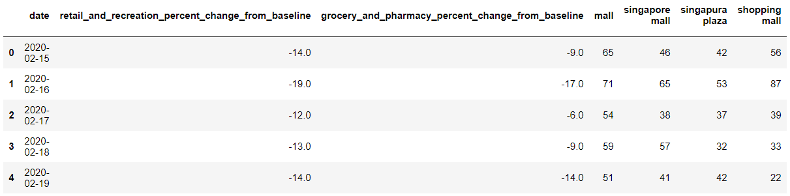
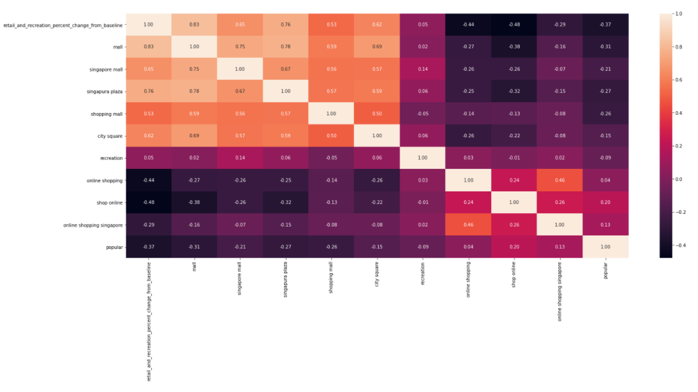
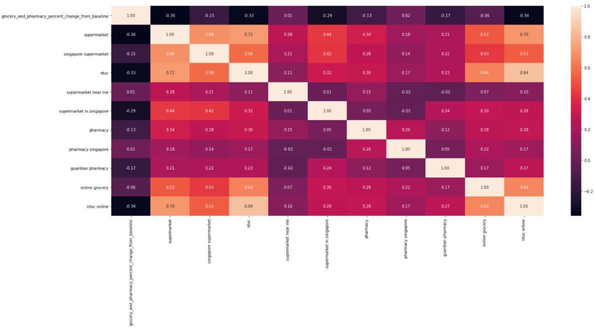
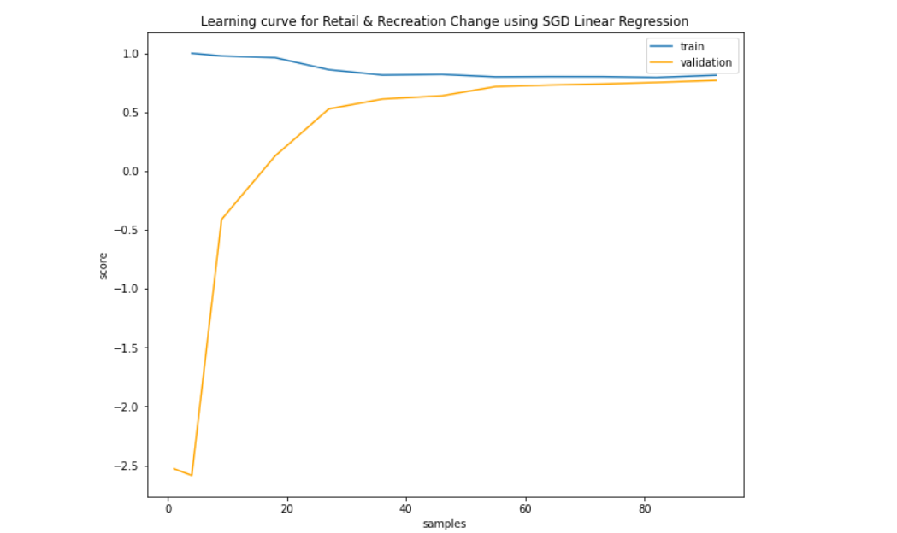
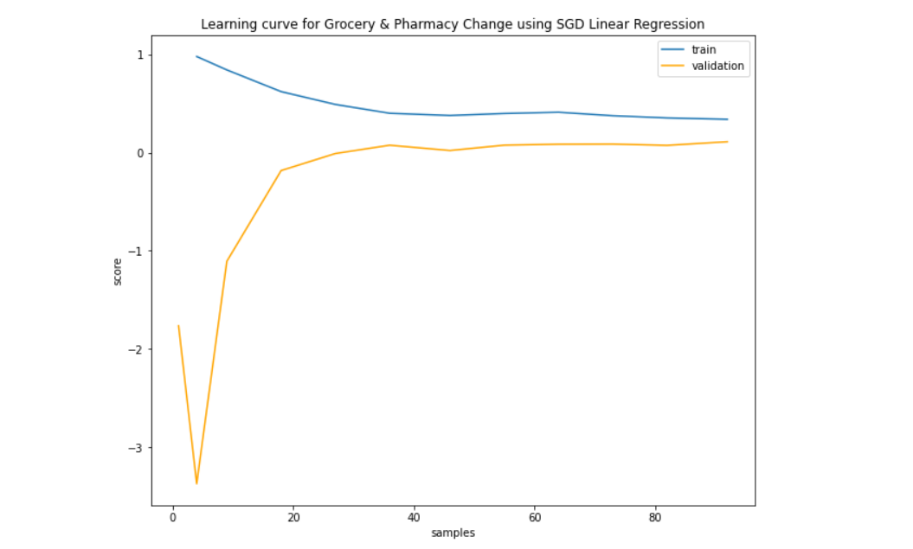

## A Study of the Correlation between Google Search Trends and Mobility Data in Singapore

As traditional methods of data collection requires lots of time and materials, there has been a global shift towards online data collection. Google Trends is one of them. Furthermore, with the rise of technology usage and the Internet being a useful go-to resource, internet-derived information has been recognised as one of the most accurate sources of data collection.

Hence, our project stood to test against this hypothesis that the Internet is an accurate source of data collection, using Google Trends as our parameter.

**Hypothesis:** Google keyword searches can act as a proxy for other data. For this project, we will see if Google Trend searches can approximate physical mobility data.

Our focus was on studying the correlation between **mobility data** and **shopping-related Google search queries**, and whether mobility data can be approximated using a **Multi-variate Linear Regression model** trained on search query data.

## Contents

This README is a document summary. View the complete notebook [here](Study of the Correlation Between Google Trends Data and Mobility Data.ipynb).

1. Libraries Used
2. Datasets Used
3. Methodology
4. Possible Explanations of Results
5. Conclusions
6. Future Research
7. Credits
8. License

## Libraries Used

The notebook was created and edited using Jupyter Notebooks. The language used was Python.

1. Pandas
2. Seaborn
3. Matplotlib
4. Sci-Kit Learn

## Datasets Used

**Name:** Covid Mobility Reports
**URL:** https://www.google.com/covid19/mobility/

We use the "Retail and Recreation" and "Grocery and Pharmacy" data fields.

**Name:** Google Query Trends
**URL:** https://trends.google.com/trends/?geo=US

*Note: We only focus on Singapore's data.*

The following search keywords were chosen for the Google Query Trends data:

**Retail and Recreation**:

1. mall
2. singapore mall
3. singapura plaza
4. shopping mall
5. city square
6. recreation
7. recreational

8. online shopping
9. shop online
10. online shopping singapore
11. popular
12. best online shopping
13. wish shopping

**Groceries and Pharmacy**:

1. supermarket
2. singapore supermarket
3. ntuc
4. supermarket near me
5. supermarket in singapore
6. pharmacy
7. pharmacy singapore
8. guardian
9. guardian pharmacy
10. pharmacy near me

11. online grocery
12. singapore online grocery
13. indian grocery online
14. ntuc online grocery
15. ntuc online

## Methodology

We obtained both the Mobility Data for Singapore (focusing on the "retail and recreation" and "grocery and pharmacy" data fields) as well as Google Search Query Data for the search terms listed above. After cleaning the data and joining everything into a single Pandas DataFrame, we get a set of data as shown below (truncated):

*Note: The data runs from 15 Feb 2020 to 21 Aug 2020.*

#### Correlation Matrices

We had a mix of search query data that we expected to positively correlate with mobility data (eg. "supermarket near me" correlating positively with Grocery and Pharmacy mobility data), as well as query data of terms related to online shopping, that we expected to negatively correlate ("online shopping singapore" is expected to correlate negatively with Retail and Recreation mobility data). With our data in hand, we created two **Correlation Matrices** to visualize the data.

*Retail and Recreation Matrix:*

Searches for the words 'mall', 'singapura plaza' had the highest correlation to Retail and Recreation changes, while other searches such as 'online shopping', 'shop online' were negatively correlated to Retail and Recreation change. This confirmed our suspicions of how the Google search queries are correlated to mobility data.

*Grocery and Pharmacy Matrix:*

However, we cannot see the same pattern for the Grocery and Pharmacy matrix. We hence expect that search query data will be a good approximation for Retail and Recreation mobility data, but not for Grocery and Pharmacy data.

#### Multi-variate Linear Regression

We then proceeded to train two **Multi-variate Linear Regression** models, one for Retail and Recreation and one for Grocery and Pharmacy. Each model is trained with the data of search queries related to the area (see "Datasets Used" above for the complete list), **leaving out online shopping-related queries** (and therefore only using terms we expect to positively correlate). The r2 scores for each model are listed below (maximum of 1):

- **Retail and Recreation Model Score:** 0.7887157723396261
- **Grocery and Pharmacy Model Score**: 0.13404931041411638

As can be seen, the Retail and Recreation model performs far better than the Grocery and Pharmacy model.

Next, we train another two Multi-variate Linear Regression models the same way, this time including *all* the data (including queries related to online shopping). The new r2 scores are shown below:

- **Retail and Recreation Model (with Online) Score:** 0.8293117595551914
- **Grocery and Pharmacy Model (with Online) Score:** 0.28069693725883205

This shows that both models benefit from including online shopping-related terms.

#### Learning Curves

Finally, we make sure that our conclusions are valid by plotting the Learning Curves of each model (for the models utilizing all the data).

*Retail and Recreation Learning Curve:*

Looking at the learning curve, the train score and validation score converges quite convincingly at around 0.7-0.8, even with a small training size. This shows that the model is quite good despite the small overall size of the data.

*Grocery and Pharmacy Learning Curve:*

At a glance, the graph looks similar to that of the Retail and Recreation model. However, the validation score converges to zero. This implies that the model is wholly inaccurate, which validates our conclusions that the Retail and Recreation model is relatively accurate, while the Grocery and Pharmacy model is not.

## Possible Explanations of Results

#### High correlation in Retail and Recreation model:
A high correlation indicates that online searches were high in beginning 2020, drastically dropped in mid 2020 and moderate level in late 2020. This is reasonable due to the Circuit Breaker implementation in mid 2020 where huge restrictions were placed on gatherings, recreational activities and availability of facilities. In this phase, there was a low need to search on recreational activities/venues online. In late 2020 where Phase 2 started and restrictions were loosened, online searches rose with human traffic as such searches are usually stem from strong intents to visit that particular place, providing a stronger correlation between searches and physical visits. In addition, it is highly possible that people are searching about the new regulations implemented and on the limited availability of facilities. With greater uncertainty, people are likely to turn to online searches to find solutions.

#### Low correlation in Grocery and Pharmacy: 2 possible scenarios
1. **Unrelated fluctuations:**
Regardless of COVID-19 impacts, including Circuit Breaker and additional restrictions, groceries and pharmaceutical products are considered to have inelastic demand. Therefore, regardless of the online options that people explored, foot traffic generally stayed stable despite circuit breaker measures, as seen in the visual representation of the Grocery and Pharmacy mobility data. This results in a low correlation between mobility data and query data.

2. **Consistently low searches:**
    Considering that grocery/pharmacy shopping is a very common (and important) activity, people are more well aware of such news due to repeated emphasis on news/word-of-mouth. Furthermore, restrictions on supermarkets and pharmacies are usually standardised and are more well-spread among the masses. These result in the lower need to search online.
## Conclusions

So, is Internet data, specifically query data, an accurate proxy of actual data in the offline space? We would say it depends.

Our results show that our RnR model is rather accurate with a score of 0.82, indicating that when the data is right, query data can be an excellent stand in for mobility data. However, the GnP model, with a score of 0.28, performed abysmally, indicating that such a method of data collection can also go horribly wrong.

Our conclusion is that there is definitely potential in using Internet data to approximate offline data, but care must be taken to ensure that this method is not used on an unsuitable set of data.

## Future Research

Our team expected that results would have a high correlation score, proving that the internet will be an accurate source due to the high dependence and usage of technology in Singapore.

Further research can be conducted on why the Grocery and Pharmacy deviates so much from a perfect correlation. Our team has expected GnP to be very much correlated in the inverse trend due to the mutually exclusive nature of online shopping and physical shopping trips. Increasing popularity and awareness of online shopping, partnered with the reduced willingness to head out due to higher health risks involved, we should expect that online searches move from a low (beg. 2020 - pre-COVID) to a high (mid 2020 - Circuit Breaker) and to a moderate-low level (late 2020 - Phase 2). It should seem fairly reasonable to assume an inverse relation between actual shopping trips and online shopping as they are mutually exclusive. Yet, our data showed otherwise. By delving deeper into this issue, we can understand more about the bigger question of <b>what makes a set of online data a good proxy for physical data</b>.

The scope of this study was also limited by the data that we had. In future studies, the scope could be expanded to include data of other fields (other than shopping) and other types of data (other than query data and mobility data). Our dataset was also rather small (although, as seen from the learning curves, sufficient). If possible, another study with a more robust data set to confirm our findings might be appropriate.

## Credits

The team behind this study comprised of:

- Nicholas Ho (team lead)
- Cyan Lee
- Emily Tan
- Zoey Neo

## License

This study is licensed by the GNU Lesser General Public License v3.0.

GNU © Nicholas Ho, Cyan Lee, Emily Tan, Zoey Neo